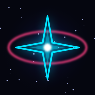
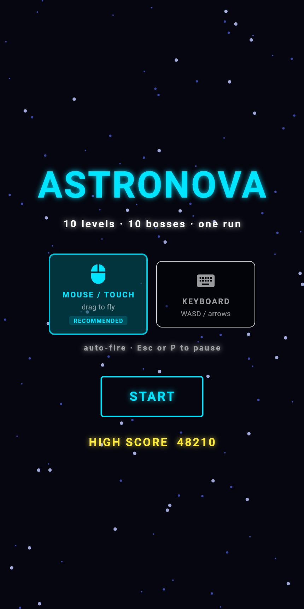
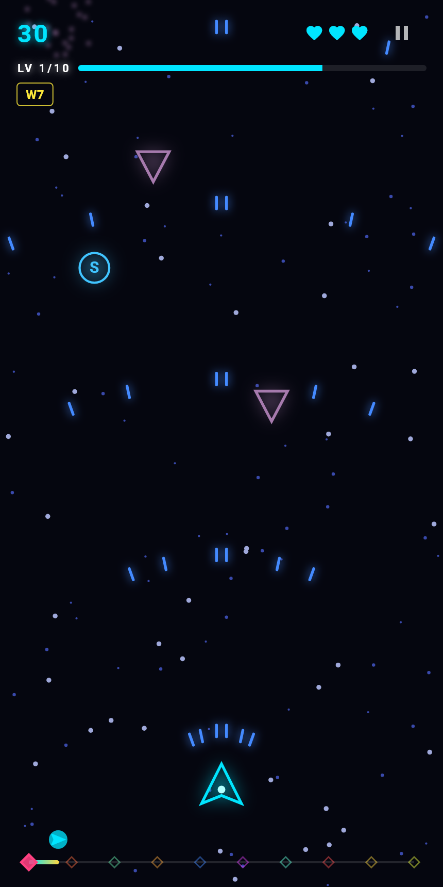
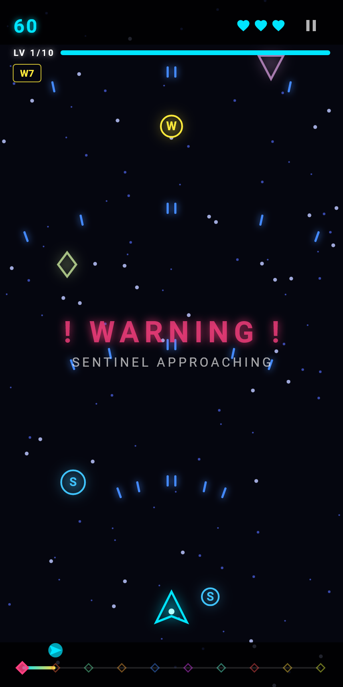
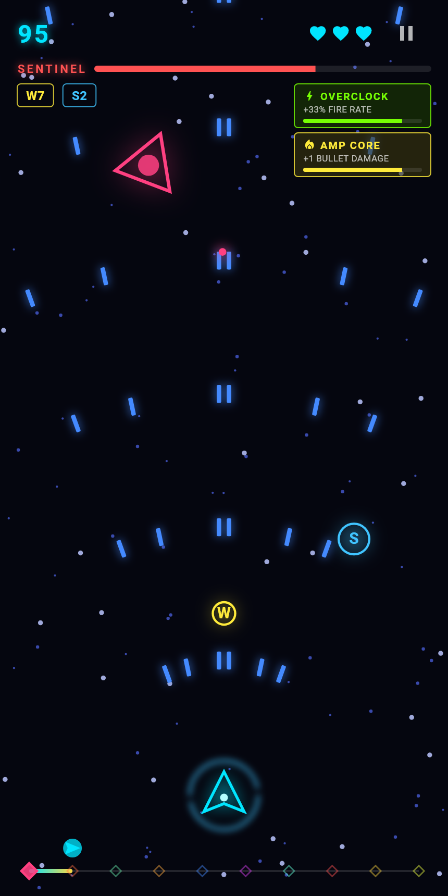

<div align="center">



# AstroNova

**A 10-level neon space shooter built with Flutter and the [Flame](https://flame-engine.org/) game engine.**
Every pixel is vector-rendered in code — no sprite assets, just `Canvas`, glow, and particles.

[**▶ PLAY IT IN YOUR BROWSER**](https://kemoemam.github.io/astro_nova/)

*Runs on web, Android, and iOS from a single codebase.*

</div>

---

## Screenshots

| Main menu | Wave combat | Boss cinematic | Boss fight |
|:---:|:---:|:---:|:---:|
|  |  |  |  |

## What this project demonstrates

This repo is a portfolio piece showing that the Flutter framework goes well beyond CRUD apps — a complete, finishable game with real systems design:

- **Game-engine architecture** on Flame: component tree, fixed-resolution camera, collision detection, particles, camera shake
- **Hybrid rendering** — the game world is a Flame canvas; menus, HUD, buff timers, and the campaign map are ordinary Flutter widgets driven by `ValueNotifier`s through Flame's overlay system
- **Data-driven design** — 30 weapon tiers generated from a progression formula, 10 boss specs, 10 level themes, and a timed-buff table are all declarative data, not branching code
- **Feature-first clean architecture** — small files, clear layers, zero god-classes
- **Quality gates** — 12 widget/unit tests, `flutter analyze` clean, CI that tests → builds → deploys to GitHub Pages on every push

## Gameplay

A **10-level campaign designed to be finished in one sitting (~10 minutes)** — short wave phases with a visible progress bar, a cinematic boss at the end of every level, and a new visual theme per sector.

- **Move:** drag / mouse (recommended) or WASD / arrow keys · **Fire:** automatic · **Pause:** `Esc` / `P`
- **Weapons:** 30 tiers — barrels, spread pairs, homing missiles, piercing, damage, and fire rate unlock on separate schedules; bullet color and shape (bolt → diamond → orb → beam) evolve as you climb
- **Shields:** 5 tiers — orbiting charge arcs, shockwave-on-absorb from tier 3, regeneration at tier 5, where the ship *ascends* with a hue-cycling hull and aura
- **Enemies:** 6 types; a new one unlocks every 3 levels (accelerating Darter, splitting Splitter, phasing Phantom), all tinted by the level theme
- **Bosses:** 10 unique specs (shape, movement, attack mix) with WARNING letterbox cinematics — level 5 is a twin fight, level 10 a triple finale with a shared HP bar
- **Boss Cores:** every boss fight drops exactly one relic granting a timed buff (fire rate, magnet, damage, score) shown in a countdown sidebar
- **Fairness systems:** pity timer guarantees a weapon drop every level; enemies are invulnerable until on-screen; difficulty ramps smoothly while your power curve grows faster

## Architecture

```
lib/
├── main.dart                          # app shell + overlay routing
└── src/
    ├── core/                          # palette, 10 level themes
    ├── game/
    │   ├── astro_nova_game.dart       # FlameGame: camera, run lifecycle, notifiers, buff ticking
    │   └── level_manager.dart         # campaign state machine (intro → waves → boss → clear)
    ├── features/
    │   ├── player/                    # ship (input, firing, shields) + 30-tier weapon table
    │   ├── enemies/                   # 6 enemy types + level-configured spawner
    │   ├── bosses/                    # 10 boss specs, multi-boss fights, Boss Core drops
    │   ├── combat/                    # bullets (spread/pierce/homing), boss bullets, explosions
    │   ├── powerups/                  # drop economy + timed buff definitions
    │   ├── environment/               # theme-lerping backdrop, parallax starfield
    │   └── effects/                   # cinematic banners, floating text, shockwaves, camera shake
    └── ui/
        ├── overlays/                  # menu, HUD, pause, game over, victory (Flutter widgets)
        └── widgets/                   # buff sidebar, campaign map, level/boss bar
```

Design decisions worth reading the code for:

- **Fixed-resolution viewport (400×800)** — identical gameplay on phone, desktop, and web; the viewport letterboxes the rest
- **Per-run subtree** — everything belonging to a run lives under one `runRoot` component, so restart is a single subtree swap
- **Enhanced enums & spec tables** — adding an enemy type or boss is a data change, not a code change
- **Race-free multi-boss logic** — boss deaths count live components with a defeat flag, so simultaneous kills can't double-drop rewards
- **No image assets** — every visual is `Path` + `MaskFilter.blur` glow or the `Particle` API; even the app icons are generated by [a `dart:ui` script](test/tools/generate_icons_test.dart), and the screenshots above by [a deterministic test harness](test/tools/generate_screenshots_test.dart) that pumps the real game to exact timestamps

## Running locally

```bash
flutter pub get
flutter run -d chrome     # or any device
flutter test              # 12 tests
```

## CI / CD

Every push to `main` runs `flutter analyze` + `flutter test`, builds the release web bundle, and deploys it to GitHub Pages — the play link above is always the latest commit.

## Roadmap

- [ ] SFX + music (`flame_audio`)
- [ ] Online leaderboard
- [ ] Endless mode after the campaign

## License

MIT
